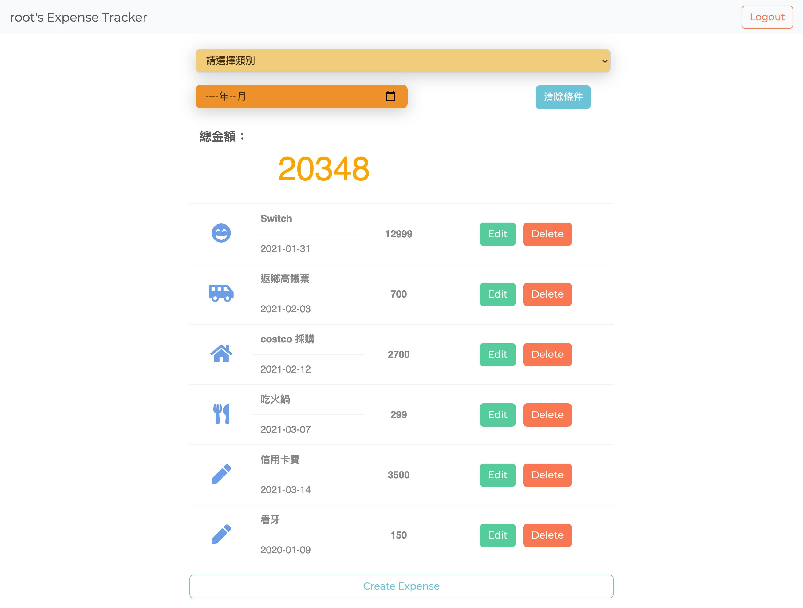
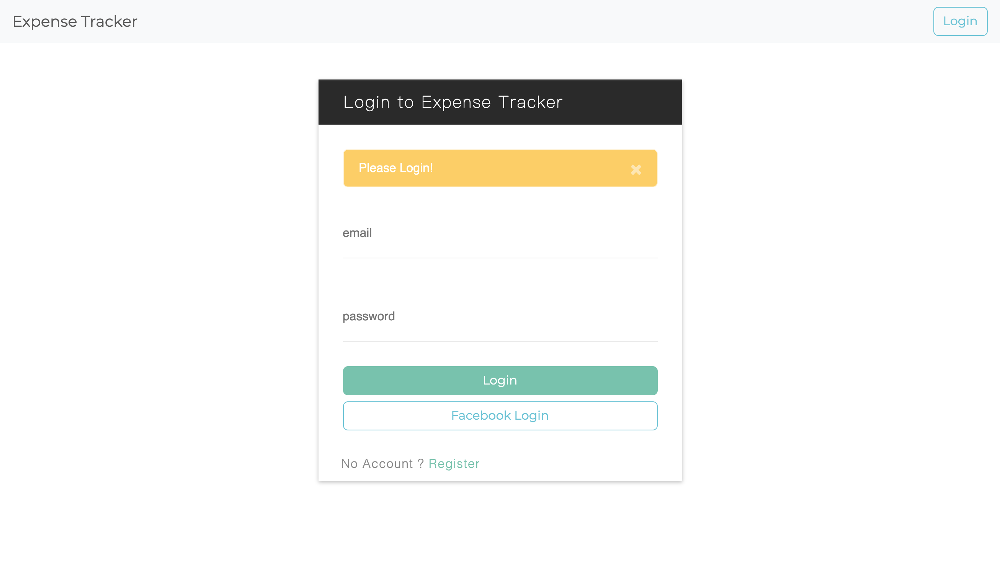

<!-- ABOUT THE PROJECT 3 A3: 老爸的私房錢升級 -->
## :money_with_wings: Expense Tracker

:moyai:
You can see on [heroku](https://intense-spire-30373.herokuapp.com/)

by use seed user

email: root@example.com
password: root1234


### :heavy_check_mark: Features



1. 使用者可以從首頁瀏覽總花費金額及所有支出
  * 名稱
  * 類別
  * 日期
  * 金額

2. 使用者可以從首頁點擊「Create Expense」，新增一筆支出
  * 名稱
  * 商家
  * 類別
  * 日期
  * 金額

3. 使用者可以從首頁點擊「Edit」，修改該筆支出
  * 名稱
  * 類別
  * 日期
  * 金額

4. 使用者可以從首頁點擊「Delete」，刪除該筆支出  
  
5. 使用者可以從首頁選擇類別及年/月，顯示設定搜尋條件的支出，點擊「清除條件」可重新設立篩選條件。

6. 新使用者可以註冊帳號並登入，使用自己的支出記帳。




<!-- GETTING STARTED -->
## :bulb: Getting Started

#### Clone repository
```
$ git clone https://github.com/BoboLin945/expense-tracker.git
```
#### Install by npm
```
$ npm install
```
#### DB Seed
```
$ npm run seed
```
#### Execute
```
$ npm run dev
```
#### Browse the website on localhost
```
http://localhost:3000/
```


### 🔧  Built With

* [Node.js](https://nodejs.org/en/) (^10.15.0)
* [Express](https://expressjs.com/)   (^4.17.1)
* [Express-Handlebars](https://www.npmjs.com/package/express-handlebars) (^5.3.2)
* [Bootstrap](https://getbootstrap.com) (^4.3.1)
* [mongoose](https://mongoosejs.com/) (^5.12.11)
* [passport] (^0.4.1)
* [connect-flash] (^0.1.1)